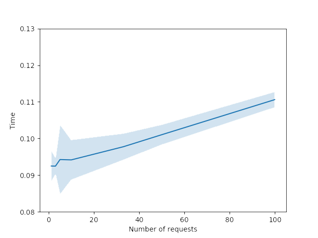

.. _performance:

Sender performance
==================
Percieved performance can be greatly improved with :mod:`senders <tekore.sender>`.
This document explains those gains in detail.

Firstly, keeping connections alive approximately doubles the speed at which
simple requests like retrieving albums are made.
Keepalive is available with Persistent and Singleton senders.
Secondly, using a cache to store responses may benefit some applications.

Advantages of caching can be shown with two examples:
a toy example to demonstrate the performance gain of caching a single response,
and a simulation of multiple resources being requested repeatedly at random.
Here's a graph of the time spent requesting a single cacheable resource.

With this particular call, requesting the resource takes 0.09 seconds,
while subsequent calls are made ca. 400-500 times faster.

Next, a more ellaborate simulation is performed.
By randomly sampling and requesting from a pool of 100 tracks,
the effect of cache size to performance can be demonstrated.

.. image:: cache_size.png
   :alt: effect of cache size

Clearly there is a performance gain to be had using a cache,
but when more resources are in play, the gain is not as large.
When all items fit into the cache, the API is completely out of the picture
and performance is only limited by cache management.
Therefore, applications that use the same few static resources often
benefit the most from caching.
But having every resource in the cache may not be a very plausible scenario.

Here is the code that was used to produce these examples.
Sleeping was used to avoid hitting rate limits, which would affect timing.

.. code:: python

    import numpy as np
    import pandas as pd

    from time import sleep
    from timeit import timeit
    from random import choice
    from tekore import Spotify, util, sender
    from matplotlib import pyplot as plt

    conf = util.config_from_environment(return_refresh=True)
    token = util.refresh_user_token(conf[0], conf[1], conf[3])

    def mk_sender(size: int = None):
        return sender.CachingSender(
            max_size=size,
            sender=sender.PersistentSender()
        )

Comparing Transient and Persistent senders:

.. code:: python

    pause = 0.1
    repeat = 1000

    def simulate_requests(n: int):
        for _ in range(n):
            spotify.album("1qD29n5sWzkZPnMOFSkCIC")
            sleep(pause)

    spotify = Spotify(token, sender=sender.TransientSender())
    t1 = timeit(f'simulate_requests({repeat})', number=1, globals=globals())

    spotify = Spotify(token, sender=sender.PersistentSender())
    t2 = timeit(f'simulate_requests({repeat})', number=1, globals=globals())

    print(t1 - pause * repeat, t2 - pause * repeat)

Requesting a single cacheable resource:

.. code:: python

    repeat = 100
    x = np.array([1, 3, 5, 10, 33, 50, 100])
    t = np.zeros((x.size, repeat))

    stmt = 'spotify.album("1qD29n5sWzkZPnMOFSkCIC")'
    for n, number in enumerate(x):
        for i in range(repeat):
            spotify = Spotify(token, sender=mk_sender(None))
            t[n, i] = timeit(stmt, number=number, globals=globals())
        sleep(1)

    mean = np.mean(t, axis=1)
    std = np.std(t, axis=1)

    plt.figure()
    plt.plot(x, mean)
    plt.fill_between(x, mean + std, mean - std, alpha=0.2)
    plt.xlabel('Number of requests')
    plt.ylabel('Time')
    plt.ylim([0.08, 0.13])

Effect of cache size:

.. code:: python

    pause = 0.1
    repeat = 1000
    sizes = [1, 100, 25, 75, 50]
    t = np.zeros(len(sizes))

    spotify = Spotify(token, sender=sender.PersistentSender())
    tracks = spotify.playlist_tracks('37i9dQZF1DX5Ejj0EkURtP')
    tracks = spotify.all_items(tracks)
    track_ids = [t.track.id for t in tracks]

    def simulate_requests(n: int):
        for _ in range(n):
            id_ = choice(track_ids)
            spotify.track(id_)
            sleep(pause)

    for i, s in enumerate(sizes):
        spotify = Spotify(token, sender=mk_sender(s))
        simulate_requests(s * 2)
        t[i] = timeit(f'simulate_requests({repeat})', number=1, globals=globals())

    df = pd.DataFrame(t, index=sizes).sort_index()

    plt.figure()
    plt.plot(df.index, (df.values - repeat * pause) / repeat)
    plt.xlabel('Cache size')
    plt.ylabel('Time per request')
    plt.ylim([0, 0.05])